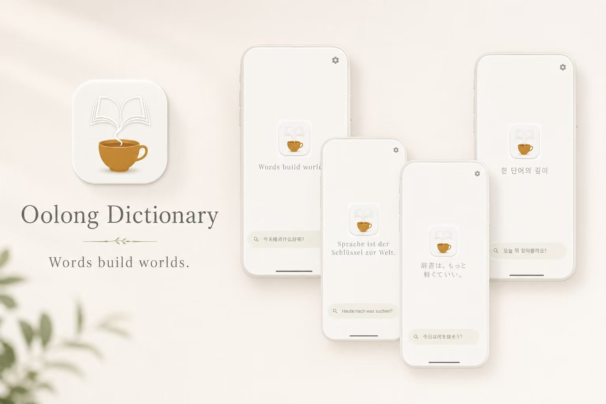
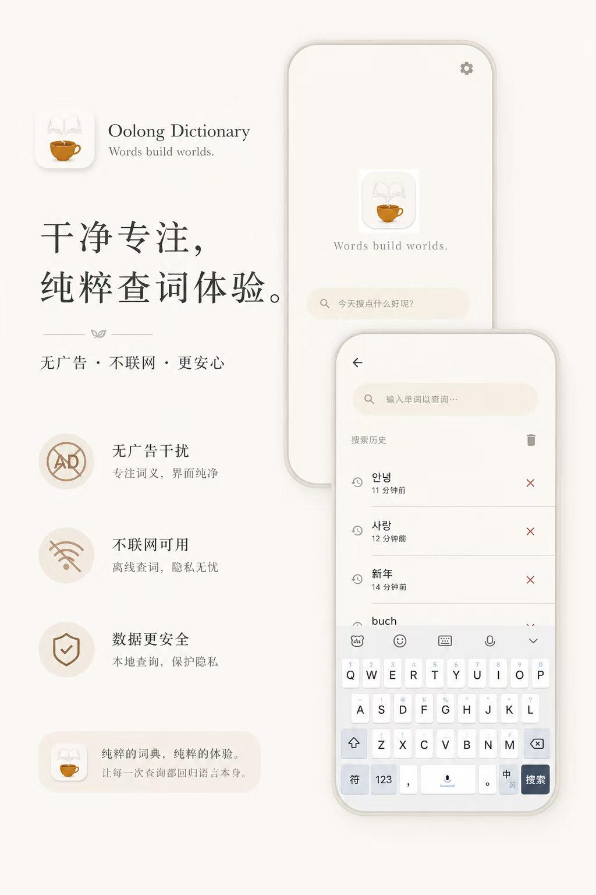
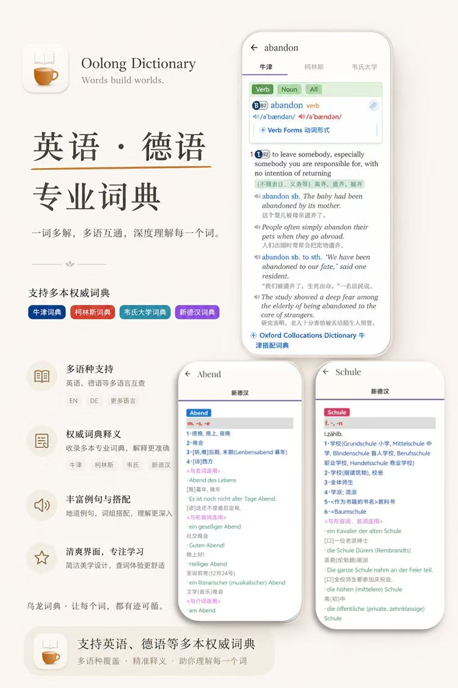
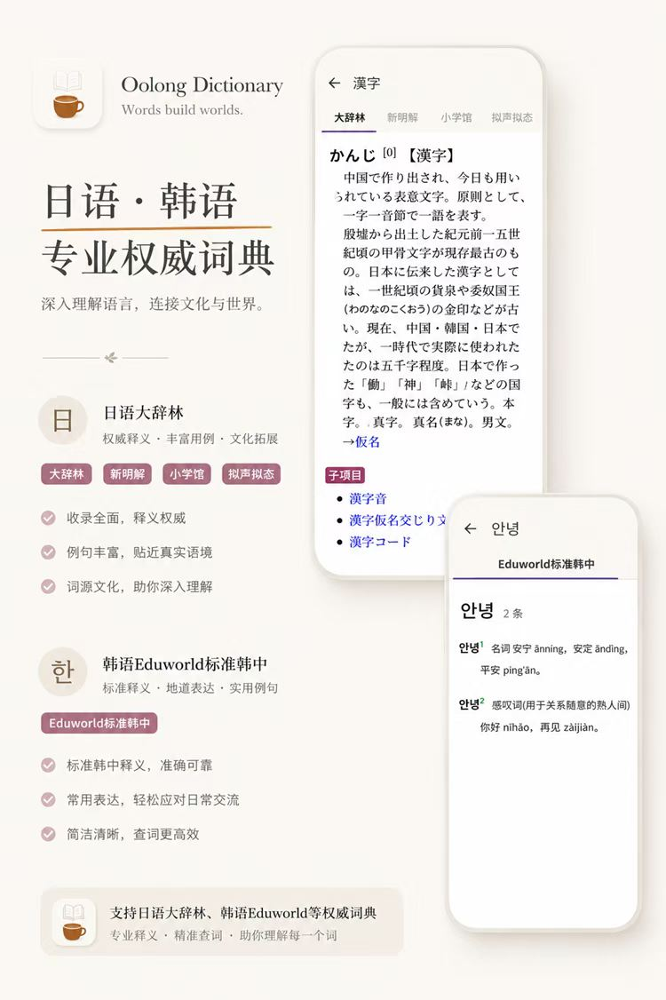

<p align="center">
  
</p>

<h1 align="center">乌龙词典</h1>
<p align="center">
  <em>Words build worlds.</em>
  <br/>
  一本安静的口袋词典 —— 五语种、全离线、零干扰。
</p>

<p align="center">
  
  
  
  
</p>

---

## 📸 预览

<p align="center">
  
  &nbsp;&nbsp;
  
</p>

<p align="center">
  
  &nbsp;&nbsp;
  
</p>

## ✨ 为什么用乌龙词典

- **完全离线** — 所有词典数据保存在本地，查词不需要网络连接
- **五语种覆盖** — 英语 · 德语 · 日语 · 韩语 · 俄语，每个语种独立切換
- **多词典并排** — 同一单词在多个词典间横向滑动对比（如英语：牛津 + 柯林斯 + 韦氏大学同时检索）
- **URL Scheme 跳转** — 支持 `@@@LINK=` 软链接重定向，自动跟踪词条引用
- **极简克制** — 奶油色暖调主题、Playfair Display 衬线字体、零广告零推送
- **WebView 对象池** — 预加载预热，词典页面秒开无白屏

## 🌏 支持的语言与词典

<details open>
<summary><b>English</b> (英语)</summary>
<table>
<tr><td>牛津高阶英汉双解词典</td><td>OALD PE</td></tr>
<tr><td>柯林斯高阶英汉双解词典</td><td>Collins COBUILD</td></tr>
<tr><td>韦氏大学词典 第11版</td><td>Merriam-Webster's Collegiate 11th</td></tr>
</table>
</details>

<details>
<summary><b>Deutsch</b> (德语)</summary>
<table>
<tr><td>新德汉词典</td><td>Shanghai Translation Publishing House</td></tr>
</table>
</details>

<details>
<summary><b>日本語</b> (日语)</summary>
<table>
<tr><td>小学馆日中词典 第三版</td><td>Shogakukan JC Dictionary 3rd Ed.</td></tr>
</table>
</details>

<details>
<summary><b>한국어</b> (韩语)</summary>
<table>
<tr><td>Eduworld 标准韩韩中词典</td><td>Eduworld Standard KO-KO-ZH</td></tr>
</table>
</details>

<details>
<summary><b>Русский</b> (俄语)</summary>
<table>
<tr><td>大俄汉词典 БРуКС</td><td>Grand Russian-Chinese Dictionary (БРуКС)</td></tr>
</table>
</details>

> ⚠️ **版权声明**：本仓库不包含任何词典数据。用户需自行获取 `.sqlite3` 格式的词典文件。

### 获取词典文件

<p align="center">
  <strong>📱 扫描下方二维码加入微信群，领取词典文件</strong>
  <br/>
  
  <br/>
  <sub>二维码有效期至 2025年7月12日，过期后请在 <a href="https://github.com/emmett001/wulongDictionary/issues">Issues</a> 留言索要新二维码</sub>
</p>

## 🚀 快速开始

### 安装

从 [Releases](https://github.com/emmett001/wulongDictionary/releases) 下载最新 APK，在 Android 手机上安装即可。

### 导入词典

1. 下载词典压缩包，解压到手机存储
2. 打开乌龙词典 → 右上角齿轮 ⚙️ → 设置
3. 点击 **导入词典文件…**
4. 选择解压后的文件夹，App 自动复制并加载

词典目录结构示例：

```
dicts/
  en/
    oaldpe/
      oaldpe.sqlite3
      oaldpe.css
      oaldpe.js
      oaldpe.png
    Collins/
      Collins.sqlite3
    MW-11/
      MW-11.sqlite3
  ja/
    Shogakukan/
      Shogakukan.sqlite3
  de/
    新德汉/
      新德汉.sqlite3
  ko/
    Eduworld/
      Eduworld.sqlite3
  ru/
    BRUKS/
      BRUKS.sqlite3
```

### 自行编译

```bash
git clone https://github.com/emmett001/wulongDictionary.git
# 用 Android Studio 打开项目 → Build → Build APK(s)
# 或直接 ./gradlew assembleDebug
```

## 🏗️ 技术架构

```
app/src/main/java/com/wulong/dict/
├── MainActivity.kt          ← NavHost + 边缘到边
├── AppContainer.kt          ← 手动 DI 容器（无 Hilt/Dagger）
├── ui/
│   ├── screens/             ← Main / Search / Entry / Settings / Activation
│   ├── theme/               ← Material 3 + Playfair Display 字体
│   └── pool/                ← WebView 对象池（预加载、复用）
├── domain/
│   ├── model/               ← Entity、Suggestion、Language
│   └── usecase/             ← 6 个 Use Case（搜索 / 建议 / 历史 CRUD）
└── data/
    ├── local/               ← SqliteDictEngine（只读 SQLite3）+ Room DB
    └── repository/          ← 接口实现
```

| 层 | 技术选型 |
|---|---------|
| UI 框架 | Jetpack Compose + Material 3 |
| 导航 | Navigation Compose + HorizontalPager |
| 架构 | Clean Architecture · 手动 DI |
| 检索引擎 | SQLite3 (只读 · LIKE 前缀匹配 · @@@LINK= 重定向) |
| 历史存储 | Room (SQLite) |
| WebView | 对象池预加载 · PagerAware · 资源复用 |
| 语言 | Kotlin |

## 📄 License

本项目代码采用 [MIT License](LICENSE)。

词典数据版权归原作者 / 出版社所有。本项目不提供、不分发、不附带任何词典内容。

---

<p align="center">
  <sub>Made with oolong tea & Compose 🍵</sub>
  <br/>
  <sub>© 2024–2025 LunaireReverie</sub>
</p>
